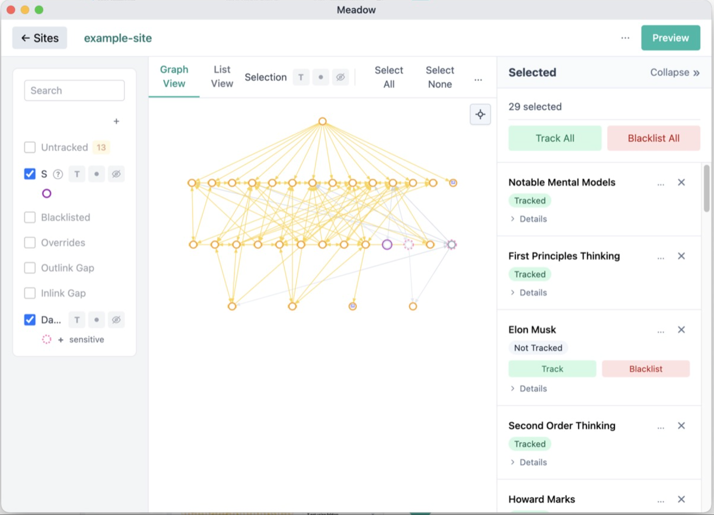

# Meadow

Publish microsites from source graphs of notes

The code behind [meadow-notes.com](https://meadow-notes.com).

# Dev

See the Readme in `_agent` for how we do agentic development

# Running the development tooling

`/dev` skill (either on `main` or in a worktree.  Works from either place)

It starts the app's backend, frontend, and then the `dev_tools_app` which is
just a nice UI for launching the app with different configurations.

# Building the app

There is an `app-build` skill that runs the build script under `app/electron_app`

# Testing - Quick

`./quickcheck` recursively runs the `./quickcheck` files nested under the
`_module/scripts` directories.  Mostly that's linting and unit tests, but it can
also be small (quick) integration tests (like for the `native_utils` Rust files)
or even slightly more comprehensive `app/system_tests` (which are still pretty
quick).

# Testing - E2E (Slow)

Run with the `/e2e` skill, which runs `app/e2e-tests/test-runner/_module/scripts/slowcheck`

It runs a large number of end-to-end scenarios using Playwright, recording
videos and snapshotting state.

To see the resulting "review packet" you can use the `/packet` skill.  That runs
the app/e2e-tests/report-viewer where you can see the results of the run, view the videos,
and look at the "packet" associated with each scenario.