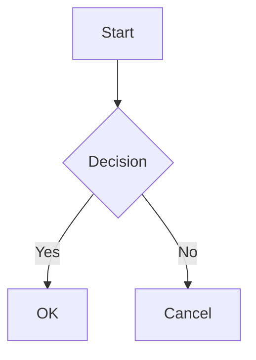

This page is a comprehensive enumeration of every extended markdown syntax variation from https://www.markdownguide.org/extended-syntax/. Some features (tables, fenced code blocks) are duplicated in other tests; this page is the single source of truth for the complete extended-syntax set.

## Tables

| Syntax      | Description |
| ----------- | ----------- |
| Header      | Title       |
| Paragraph   | Text        |

## Table Alignment

| Syntax      | Description | Test Text     |
| :---        |    :----:   |          ---: |
| Header      | Title       | Here's this   |
| Paragraph   | Text        | And more      |

## Fenced Code Blocks

```
{
  "firstName": "John",
  "lastName": "Smith",
  "age": 25
}
```

## Syntax Highlighting

```json
{
  "firstName": "John",
  "lastName": "Smith",
  "age": 25
}
```

## Footnotes

Here's a simple footnote,[^1] and here's a longer one.[^bignote]

[^1]: This is the first footnote.

[^bignote]: Here's one with multiple paragraphs and code.

    Indent paragraphs to include them in the footnote.

    `{ my code }`

    Add as many paragraphs as you like.

## Heading IDs

### My Great Heading {#custom-id}

## Definition Lists

First Term
: This is the definition of the first term.

Second Term
: This is one definition of the second term.
: This is another definition of the second term.

## Strikethrough

~~The world is flat.~~ We now know that the world is round.

## Task Lists

- [x] Write the press release
- [ ] Update the website
- [ ] Contact the media

## Emoji (Copy and Paste)

Gone camping! ⛺ Be back soon.

That is so funny! 😂

## Emoji Shortcodes

Gone camping! :tent: Be back soon.

That is so funny! :joy:

## Highlight

I need to highlight these ==very important words==.

## Subscript

H~2~O

## Superscript

X^2^

## Automatic URL Linking

Visit http://www.example.com or https://www.markdownguide.org for more.

## Disabling Automatic URL Linking

`http://www.example.com`

## Obsidian-Flavored Markdown

### Callouts

> [!note]
> This is a note callout.

> [!abstract]
> This is an abstract/summary callout.

> [!info]
> This is an info callout.

> [!todo]
> This is a todo callout.

> [!tip]
> This is a tip callout.

> [!success]
> This is a success callout.

> [!question]
> This is a question callout.

> [!warning]
> This is a warning callout.

> [!failure]
> This is a failure callout.

> [!danger]
> This is a danger callout.

> [!bug]
> This is a bug callout.

> [!example]
> This is an example callout.

> [!quote]
> This is a quote callout.

### Callout with Custom Title

> [!tip] My Custom Title
> Callouts can have custom titles.

### Foldable Callout

> [!note]+ Open by Default
> This foldable callout starts open.

> [!note]- Collapsed by Default
> This foldable callout starts collapsed.

### Comments

There is a comment below this line that you will not see in the rendered output.

%%This is a hidden comment%%

And here is a block comment that spans multiple lines:

%%
This entire block
is a comment and
will not be rendered.
%%

Text continues after the comment.

Comments inside code blocks should be preserved:

```
%%This should not be stripped%%
```

Inline code too: `%%also preserved%%`

### LaTeX Math

Inline math: $E = mc^2$

Block math:

$$
\frac{-b \pm \sqrt{b^2 - 4ac}}{2a}
$$

LaTeX inside code blocks should not be transformed:

```latex
$E = mc^2$ and $$\frac{1}{2}$$
```

Inline code too: `$E = mc^2$`

### Mermaid Diagram



```yaml
pagespecs:
  - site: meadow-test-site-big
    isTracked: true
    isInWorkingGraph: true
    links:
      outlinks: []
      inlinks:
        - linkPath: /main page.md
          isInGraph: true
    htmlRenderedLinks:
      mainSectionLinks:
        - relativeLinkPath: '#footnote-1'
        - relativeLinkPath: '#footnote-bignote'
        - relativeLinkPath: '#footnote-ref-1'
        - relativeLinkPath: '#footnote-ref-bignote'
        - relativeLinkPath: http://www.example.com
        - relativeLinkPath: https://www.markdownguide.org
        - relativeLinkPath: https://www.markdownguide.org/extended-syntax/
      footerSectionBacklinks:
        - relativeLinkPath: main page.html
          backlinkContexts:
            - seeInContextLinkRelativePath: main page.html
              embeddedLinks: []
  - site: meadow-test-site-small
    isTracked: false
    isInWorkingGraph: false
    frontierDepthOrNullForOrphan: null
    htmlRenderedLinks:
      mainSectionLinks: []
      footerSectionBacklinks: []
```
