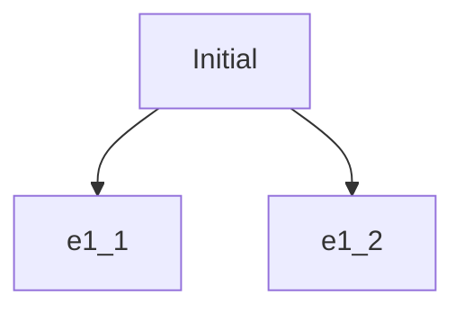
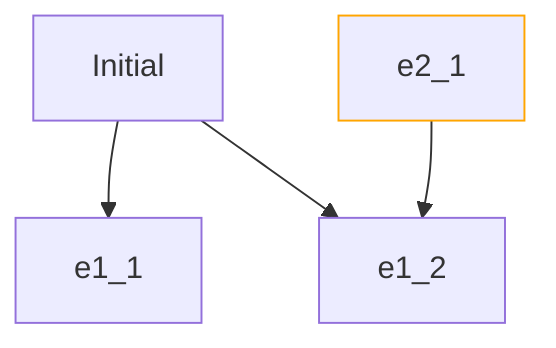
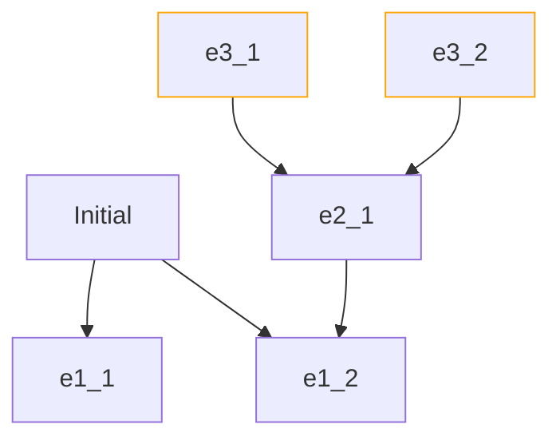
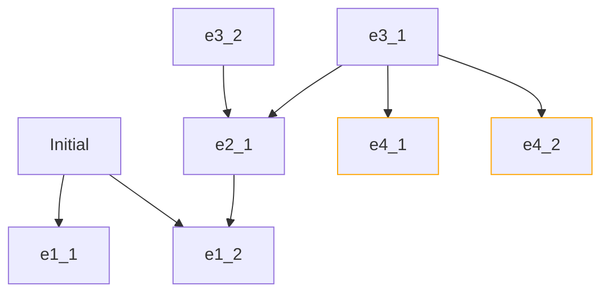
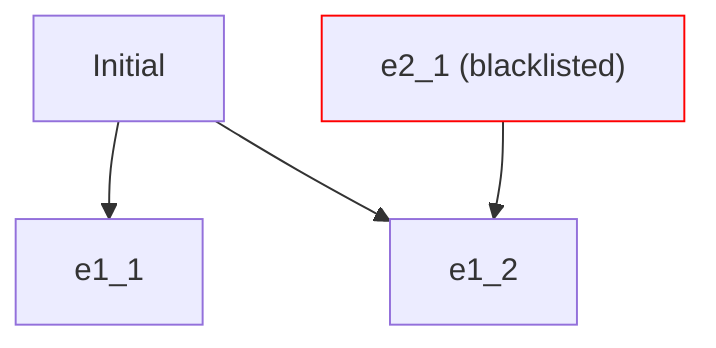
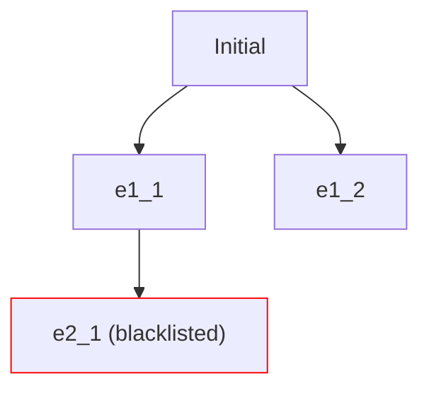

### Graph expansion from in-links

Let's say you have this graph, which you got from starting at the [[site page type -- initial]] and doing a standard [[outlink]] graph expansion.  The initial page has [[outlink]]s to `e1_1` and `e1_2`, so the graph expands to include them.

Let's assume, for simplicity that the initial page had no [[inlink]]s.  So, we're done for this iteration.

For the rest of this section, we will mostly concern ourselves with [[inlink]]s (not the [[outlink]]s we were just talking about), and the process of [[constrained graph expansion]] when considering them.  Ok, so now, let's find all the [[inlink]]s into all the pages in this graph in that first layer beyond the initial page.  In this case there is a single page `e2_1` that points *in* to `e1_2`, so it is an [[inlink]] for the `e1_2` page. (The pages are just named to highlight how far they are from the initial page)

Then you iterate again by checking the [[inlink]]s into any of the pages you just added... in this case the [[inlink]]s to `e2_1`, of which there are 2.. `e3_1` and `e3_2`

This process continues until no more new pages are found that point to most recently added pages.

### Graph expansion from out-links

Ok, cool that covered [[inlink]]s... but what if `e3_1` (for example) actually had [[outlink]]s (see the switcheroo I'm doing here?) to some _other_ pages, like `e4_1` and `e4_2` shown below?

From this example, it is clear that the expansion of the graph is not *purely* backwards via [[inlink]]s, but that we need to consider [[outlink]]s for every page added... even though the page (like `e3_1` above) was added via [[backwards expansion]], considering only [[inlink]]s.

### Blacklisting in-links

[[Meadow]] generally doesn't publish _entire_ [[source graph]]s, but rather [[to review - subgraph]]s.  That means we need to be able to constrain the publishing somehow.  

meadow-todo we have subsequently added [[site page config -- outlinksDepth]] and [[site page config -- inlinksDepth]] .  Need to update the block below.
:
We do this with either [[site page tracking state -- tracked]], which is essentially whitelisting, or [[blacklist]]s.  Let's consider blacklists here.

If the [[inlink]] is added to the [[blacklist]] or the [[filter example -- source page - page criteria matches]], then it does not show up in the [[backlink]] listing (and those pages from the second expansion do not become connected to the [[published site type -- local html]], either).  So, below, you do not see `e2_1` in the backlinks for `e1_2`.  This type of link is called [[link type - internal - in-link - quietly hidden]] and is [[published graph constraining]].

*Although the page is shown in the diagram, is only shown for illustrative purposes, to show it is blacklisted.  It would highlight to the [[publisher]] in the [[app component -- site page views]] if they enabled [[site pages filter option -- blacklisted]], however, it is not actually published to the [[published site type -- local html]], so no [[reader]] would ever see it*

### Blacklisting out-links

Let's say you [[blacklist]] a page and `e1_1` points to it with an [[outlink]]:

This is a considerably more complicated task, because the `e2_1` page was directly mentioned in `e1_1`'s [[source page section -- body]].  What should you do with that [[unfulfillable outlink]] in the page's body text?

It depends on the sensitivity of the material in the blacklisted `e2_1` and the aesthetics of the published document.  In all of the following cases, we want to do *some kind* of [[link modification]] or even [[block modification]].  Let's limit ourselves to only considering link modification here.  The following options map from least to most sensitive:

* let the viewer see the name of the page, in place
	* [[link type - internal - out-link - name only - highlighted]]
	* [[link type - internal - out-link - name only - non-highlighted]]
* don't let the viewer see the name of the page
	* [[link type - internal - out-link - quietly hidden]] (there's just a gap in the text, which can be [[surprising]])
	* [[link type - internal - out-link - loudly blocked]] (makes it clear that the viewer was blocked from seeing something... but that there was a concept there)

A more aggressive modification approach, which we mentioned earlier and called [[block modification]], might be to allow for more comprehensive [[source page section -- body]] modification, to allow the [[publisher]] to cleanly tie up the loose ends at [[leaf site page]]s.  They could reword sections to remove [[unfulfillable outlink]]s in a natural way, for example.  This could introduce a continual [[maintenance burden]], however, because it essentially forks the original blocks.  Dealing with that burden might be an [[meadow AI opportunity]].